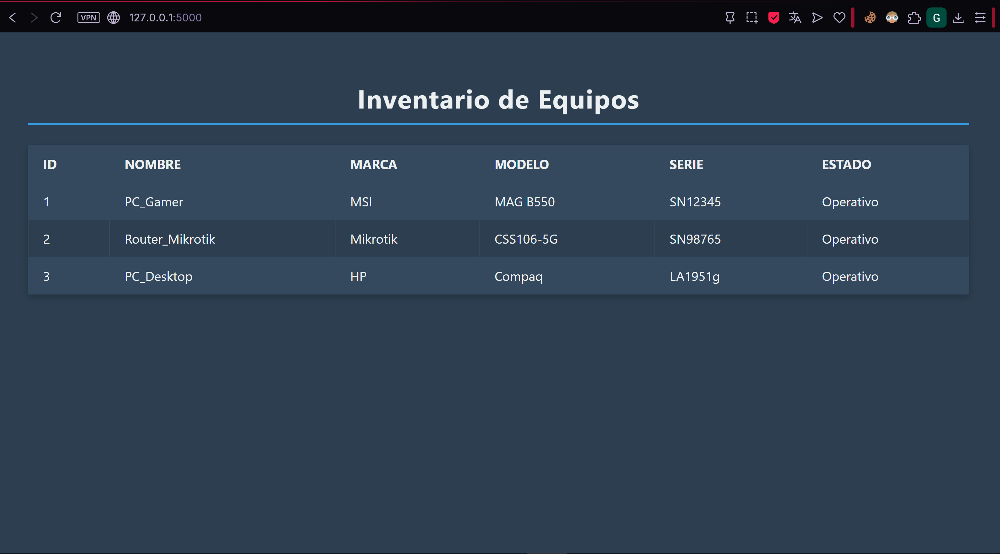

# Inventario de Equipos - Flask + SQLite

Proyecto de práctica que demuestra cómo crear una **página web local** usando **Flask** y **SQLite**, mostrando datos de un inventario en una tabla HTML.



---

## 🗂 Estructura del proyecto

practica_web/
├─ app.py # Servidor Flask
├─ database/
│ └─ inventario.db # Base de datos SQLite
├─ templates/
│ └─ index.html # Página principal
├─ static/
│ └─ style.css # Estilos CSS
├─ .gitignore # Archivos a ignorar en Git
└─ README.md # Este archivo


---

## 💻 Tecnologías usadas
- **Python 3.x**  
- **Flask** → Framework web ligero en Python  
- **SQLite3** → Base de datos local  
- **HTML / CSS** → Interfaz de usuario  

---

## ⚡ Funcionalidades
- Conexión a una base de datos SQLite.  
- Mostrar todos los registros de la tabla `equipos` en una tabla HTML.  
- Interfaz sencilla y legible con CSS básico.  

> Nota: Actualmente solo se muestra la información. Se puede mejorar agregando funciones para **insertar, eliminar o editar** registros desde la web.

---

## 🚀 Cómo ejecutar el proyecto

1. **Clonar el repositorio**
```bash
git clone https://github.com/tu_usuario/flask-inventario.git
cd flask-inventario

2. **Instalar dependencias**
pip install flask


3. **Ejecutar el servidor**
python app.py

4. **Abrir en el navegador**
http://127.0.0.1:5000/
Deberías ver la tabla con los datos de la base de datos.

🔧 Notas
La base de datos inventario.db contiene datos de ejemplo. Puedes modificarla con SQLite3 o agregar nuevas filas desde Python.

Se recomienda no subir bases de datos con información sensible a GitHub.

📈 Mejoras futuras
Agregar formularios web para insertar, editar y eliminar equipos.

Filtrado y búsqueda en la tabla por nombre o estado.

Mejorar la interfaz usando frameworks CSS como Bootstrap o Tailwind.

Control de errores y validaciones en los formularios.

📜 Licencia
Proyecto de práctica educativa. Uso libre para fines de aprendizaje.
